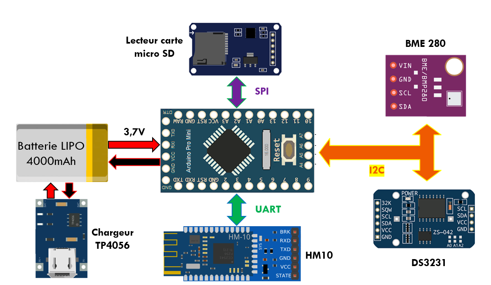
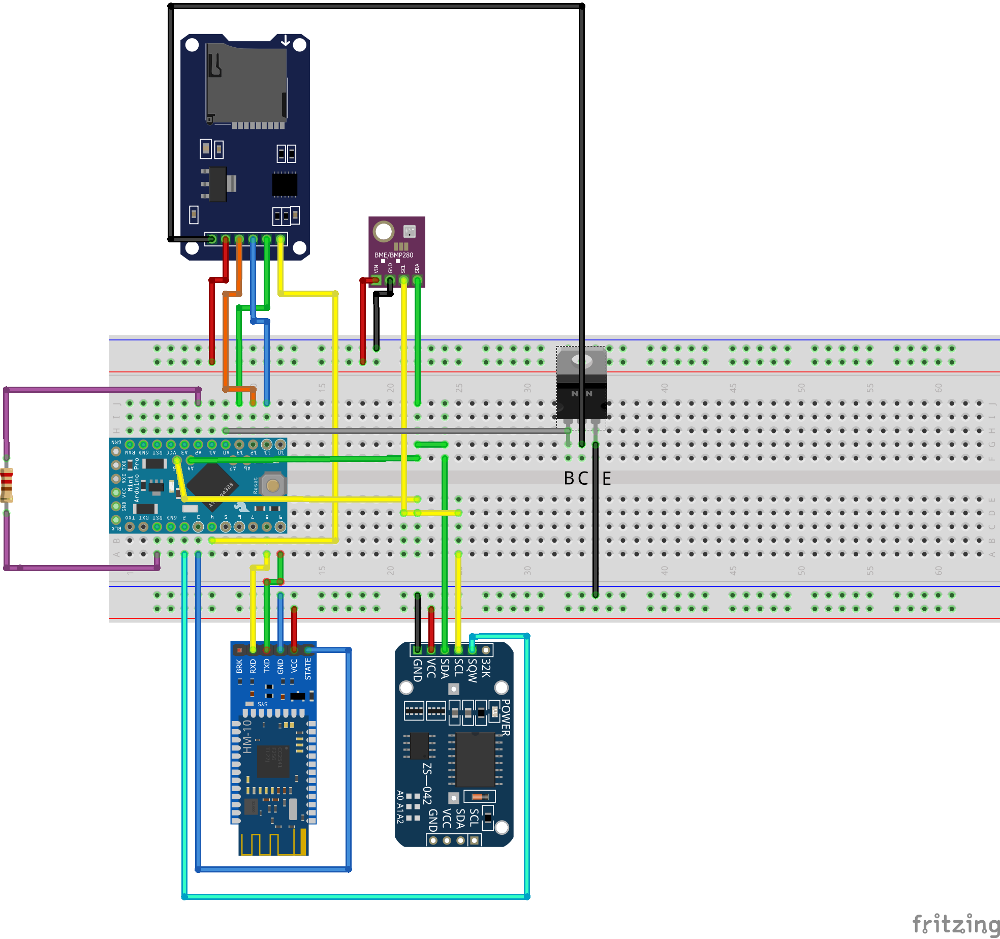

# Station Météo BLE

Une station météo (température/pression/humidité) autonome communiquant via le Bluetooth Low Energy (BLE) 

Utilisez MIT app inventor pour modifier l'application: https://appinventor.mit.edu/ (import project aia form my computer)  
Extension google charts pour app inventor (source originale) : https://github.com/MillsCS215AppInventorProj/chartmaker  
Pour savoir comment compiler l'Extention utilisez ce tuto: http://kio4.com/appinventor/125B_extensiones_crear_i.htm  

## Schéma de fonctionnement: 

## Schéma électrique:  

